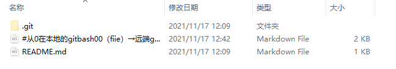
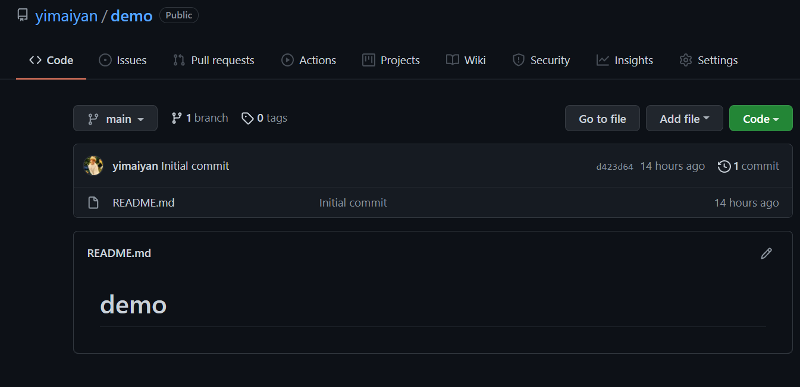
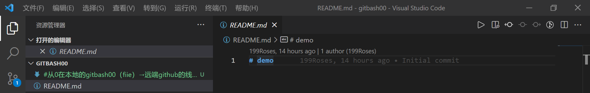
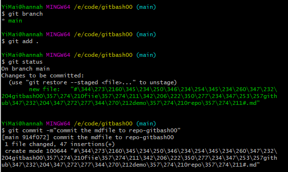
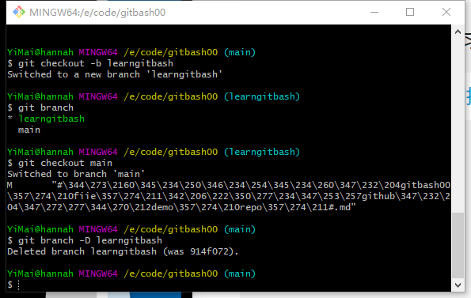
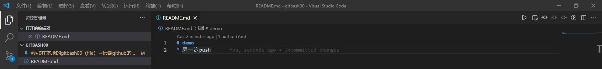
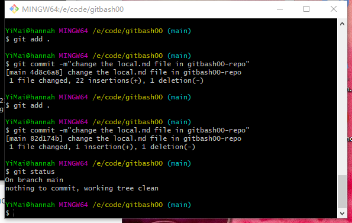
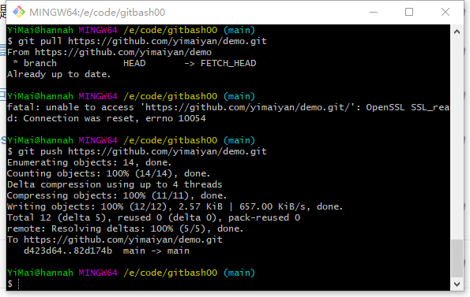
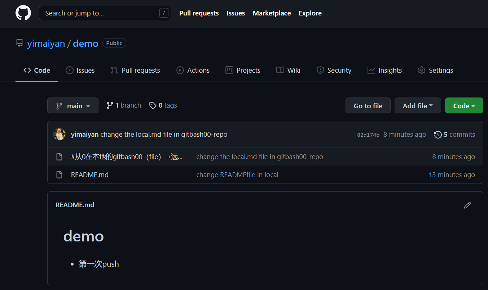
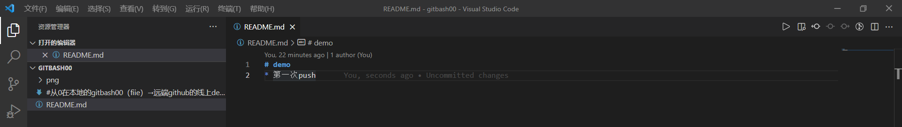

#从0在本地的gitbash00（fiie）→远端github的线上demo（repo）#

*******

**使用的教程**

* [40 分钟学会 Git | 日常开发全程大放送&搭配Github_哔哩哔哩_bilibili](https://www.bilibili.com/video/BV1db4y1d79C?p=1&share_medium=iphone&share_plat=ios&share_session_id=986BB0D7-A9BC-4B39-9949-FD6AE784D62C&share_source=WEIXIN&share_tag=s_i&timestamp=1637078230&unique_k=vxrOXx)

* [黑马程序员Git全套教程，完整的git项目管理工具教程，一套精通git_哔哩哔哩_bilibili](https://www.bilibili.com/video/BV1MU4y1Y7h5?p=9&spm_id_from=pageDriver)

* [(38条消息) Markdown语法图文全面详解(10分钟学会)_黑暗星球-CSDN博客_markdown语法](https://blog.csdn.net/u014061630/article/details/81359144)

* [(38条消息) 使用git和github进行文件同步_怡宝2号-CSDN博客_github 同步](https://blog.csdn.net/u011622208/article/details/80637661)

***

**在gitbash中步骤如下**（此md本地文档用来等会推到demo仓库）,在ubuntu中指令基本一致。

1. 在github线上准备一个demo仓库，仓库只有一个main分支以及一个README的md文件

   

2. 在本地E盘准备一个空文件夹-gitbash00

3. 右键gitbash00文件-选择在gitbash中打开，并通过code打开

4. 在bash界面-指令 git init/git log/git status进行初始化本地仓库，这时候gitbash00文件夹里面出现了一个.git文件

5. 将远程demo仓库关联到gitbash00仓库，指令

   * git romote add origin <仓库的http地址或是ssh地址>

   * git branch -M main

   * git pull  <仓库的http地址或是ssh地址>，因为本地仓库是空的，把demo里面的README拉到本地仓库

     

   * 此时去github的demo网页查看，没有任何变化

     

   * git branch 发现本地的master分支被改名为main

6. 这个时候在vscode中打开，可以看见

   

7. 这个时候需要把新建的 从0在本地的gitbash00（fiie）→远端github的线上demo（repo）.md 文件上传到gitbash00仓库，第一个指令 git add . 或是 git add <文件名>，第二个指令 git commit -m"注释"

   

8. 这个时候本地gitbash00仓库已经有了此md文件。接下来要把本地的md文件推送到github的demo仓库中。

   * 顺便学一些指令 git branch,查看当前所有分支

   * git checkout -b learngitbash，创建了一个名为learngitbash分支

   * git checkout mian

   * git branch -D <分支branch名称>

   * 这一系列操作搞完之后，github里面的demo还是无事发生

     

9. git push <demo链接>，这个时候在README.md文档里面加了一行字(要add和commit到本地仓库)，然后此文档也要add和commit。这个时候进行pull操作。**出现了一个报错-迷惑**

   

​       

​      

10. 这个时候去检查demo仓库界面-完成第一次本地到线上仓库同步！！！

    

11. 这个时候可以在vscode中看到，文件全部变灰色了。

    
