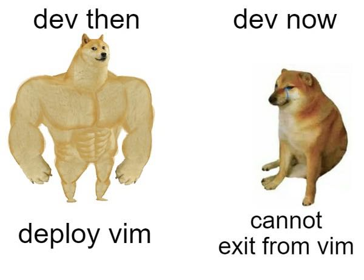

# 👋Welcome to Yimai's Org

#### _Homework of Git Basics_

_本次push来自ubuntu20.04版本下一位不愿透露姓名的的超级用户_

***

学员：颜怡麦 Yimai Yan


***

兴趣爱好：科幻和制作meme




***

#### **第一次作业总结**

**_环境配置_**

* windows10系统
* Ubuntu20.04和Ubuntu原始版本分别都存在用户组
* gitbash用户组是YiMai，Ubuntu20.04用户组是yanyimai
* 使用vscode和Typora辅助编辑

**_学到的知识_**

* gitbash使用方法

* git在ubuntu中的操作

* 常见git指令

  ```
  git init/git status/git log/git add/git commit -m""/git branch/git checkout -b/git checkout -D/git reset/git pull/git push
  ```

* linux访问Windows文件（到相应文件夹中shift+右键选择linux shell）

  ```
  访问linux文件夹
  yanyimai@hannah:~$ explorer.exe .
  访问windows中的e盘中的steam.exe文件
  yanyimai@hannah:~$ cd
  yanyimai@hannah:~$ cd /
  yanyimai@hannah:/$ cd mnt /
  -bash: cd: too many arguments
  yanyimai@hannah:/$ cd mnt/
  yanyimai@hannah:/mnt$ ls
  c  d  e
  yanyimai@hannah:/mnt$ cd e
  yanyimai@hannah:/mnt/e$ cd
  yanyimai@hannah:~$ cd /
  yanyimai@hannah:/$ cd mnt/
  yanyimai@hannah:/mnt$ cd d
  yanyimai@hannah:/mnt/d$ ls
  ```
  
* linux访问本系统盘

  ```
  yanyimai@hannah:~$ cd /etc
  yanyimai@hannah:/etc$ explorer.exe .
  ```

* linux中用vscode打开文件（需要vscode提前装好wsl-remote，不然就会当场下载一个vscode到C盘，现在本人就是非常后悔）

  ```
  yanyimai@hannah:~$ cd
  yanyimai@hannah:~$ cd /mnt/e
  yanyimai@hannah:/mnt/e$ gtb-2022-yan-yimai
  gtb-2022-yan-yimai: command not found
  yanyimai@hannah:/mnt/e$ cd gtb-2022-yan-yimai/
  yanyimai@hannah:/mnt/e/gtb-2022-yan-yimai$ cd week02/
  -bash: cd: week02/: No such file or directory
  yanyimai@hannah:/mnt/e/gtb-2022-yan-yimai$ cd homework/
  -bash: cd: homework/: No such file or directory
  yanyimai@hannah:/mnt/e/gtb-2022-yan-yimai$ cd week01/
  ```

  

* Windows访问Linux根目录，powershell中打开

  ```
  PS C:\Users\YiMai> cd \\wsl$\Ubuntu-20.04
  PS Microsoft.PowerShell.Core\FileSystem::\\wsl$\Ubuntu-20.04>
  PS Microsoft.PowerShell.Core\FileSystem::\\wsl$\Ubuntu-20.04> ls
  ```

  

* git里面放置图片需要相对位置！并且在org的profile展示页面（依然会有图片bug，因为必须把图片文件和readme文件放在同一亲目录下才能解决）

**_没解决的问题_**

* gitbash里面的用户是Yimai@DESKTOP，ubuntu里面是yanyimai@DESKTOP，非常迷惑，不确定这样子会不会造成冲突

* 电脑自带Ubuntu里面装了conda，不知道会不会有影响

* git push报错，重新提交之后又没事了。

  ```
  $ git push https://github.com/yimaiyan/demo.git
  fatal: unable to access 'https://github.com/yimaiyan/demo.git/': OpenSSL SSL_read: Connection was reset, errno 10054
  ```

* 还没用IDEA操作git，都是在用vscode

* ubuntu里面不小心下了个vscode怎么删除......

  


